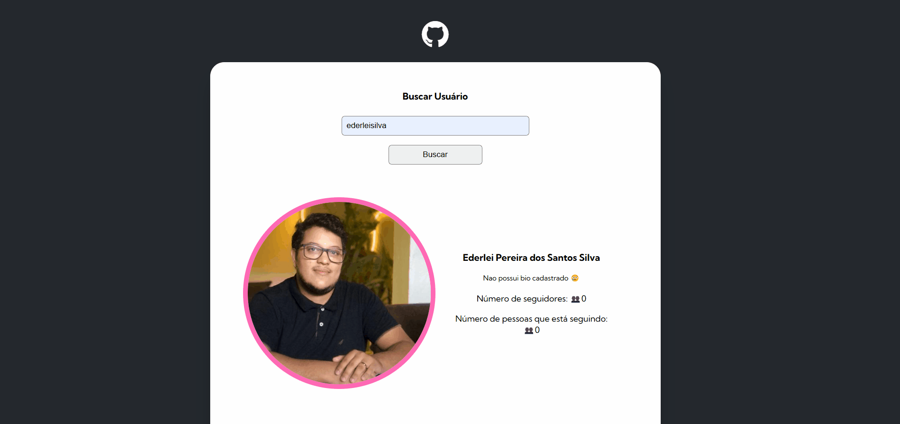

# projeto-fetch-github-api
Projeto desenvoldo para correção dado pelo curso DevQuest, foi dado um codigo inicial para podermos fazer a busca pelas informações da API do GitHub para mostrar algumas informações em tela.

## Tecnologias Utilizadas
- HTML
- CSS
- JS
